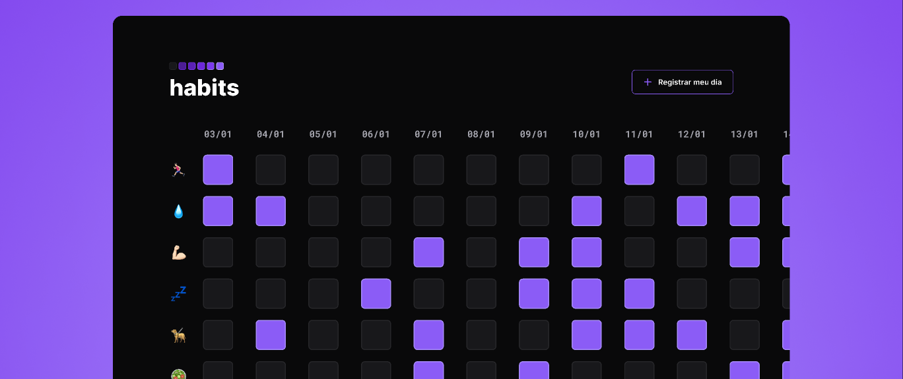

<h1 align="center"> Habits Tracker </h1>

Você deseja mudar seus hábitos? Rastrear metas? Cumprir as resoluções de ano novo? O Habits Tracker ajuda a monitorar o seu progresso.

  <a href="#-tecnologias">Tecnologias</a>&nbsp;&nbsp;&nbsp;|&nbsp;&nbsp;&nbsp;
  <a href="#-projeto">Projeto</a>&nbsp;&nbsp;&nbsp;|&nbsp;&nbsp;&nbsp;
  <a href="#memo-licença">Licença</a>

  

 

  

## 🚀 Tecnologias

Esse projeto foi desenvolvido com as seguintes tecnologias:

- HTML e CSS
- JavaScript
- Git e Github
- Figma

## 💻 Projeto

O projeto Habits Tracker é um programa exclusivo e gratuito que rastreia seus hábitos.

- [Acesse o projeto finalizado, online](https://gileaderafael.github.io/habits-tracker)

## :memo: Licença

Esse projeto está sob a licença MIT.

---

Feito com ♥ by Gileade Rafael :wave: